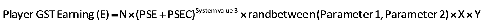

# შემოსავლის კაპიტალი/მექანიკა

### Solo Mode Earning Cap

Solo Mode has both a **Daily Energy Cap** and **Daily Token Cap**. These limits restrict the amount of Energy and tokens that users can have per day.

#### **Daily Energy Cap**

Users start the game with 2/2 Energy. Max Energy Caps at 20/20. Users can increase their Energy by getting more or higher quality Sneakers (Refer to Energy System above)

#### **Daily Token Cap**

Users start the game with a 5/5 Daily GST Cap. The Daily Token Cap maxes out at 300 GST. Users can increase their Daily Token Cap by leveling up their Sneakers. User can further permanently increase the GST cap beyond 300/300 by by burning some GMT. This option will only become visible when you reach 90% of your current Daily Cap.

There is **NO** earning cap for GMT.&#x20;

### Solo Mode Earning Mechanics

#### GST

.png>)

1. K: Player's Average Speed
2. PSE: Player's Sneaker Efficiency
3. PSEC: Player's Sneaker Efficiency's Coefficient (Gem/Socket, NFT Badges)
4. System value: Value set by the game developer, subject to change.
5. Parameter: A range of system values

In short, the factors which affect GST Earnings are:

1. Total Energy
2. Movement Speed
3. Sneaker (Type, Attributes, Quality & Level)
4. Gem (Type, Level & inserted Socket Quality)
5. NFT Badges

**Mystery Box**

Mystery box value determines if there will be a Mystery Box drop:

.png>)

1. PSL: Player Sneaker Luck
2. PSLC: Player Sneaker Luck Coefficient (Gem/Socket, NFT badges)

.png>)

In short, the factors which affect Mystery Box Quality are:

1. Energy used in one single session
2. Luck value of Sneaker
